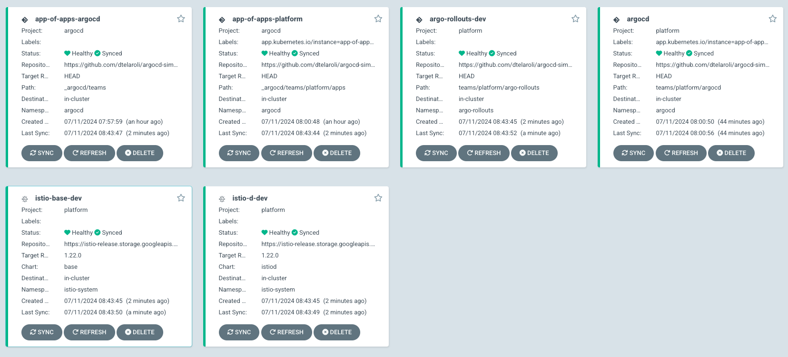
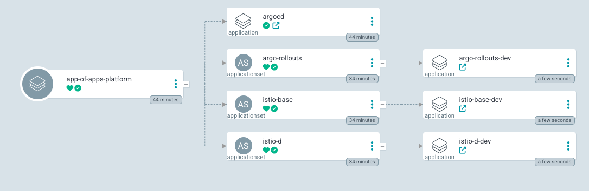
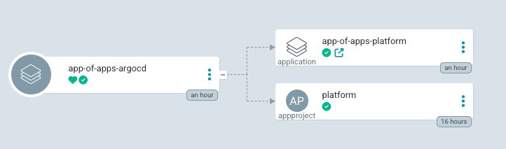

# ArgoCD Simplified

An argocd configuration boilerplate

## Árvore de diretórios

Este é um repositório que aplica o conceito de mono-repos e foi projetado para que todos o IaC do Kubernetes esteja centralizado aqui, porém isto não impede que os argo-applications escutem outros repositórios em casos específicos ou por opção do time.

### ArgoCD metadata

O ArgoCD é usado para configuração da sua própria estrutura de projetos e aplicações, para isto foi criada uma estrutura de projetos que precisa ser adicionada como pontapé inicial. Aqui temos o dilema do ovo e da galinha, onde para que o argo gerencie os apps de metadados eles precisa ser criados manualmente uma vez

```
_argocd
  # A pasta é dividida por times/domínios e para cada item é necessário configurar um app-of-apps que abriga as configurações deste time que ficam dentro da pasta em que o Application escuta, neste caso é a pasta apps.
  teams
    # Este é um exemplo de configuração de time e para cada time/domínio deve existir esta estrutura de diretório
    platform
      # Os apps do argocd dentro desta pasta, podem apontar diretamente para helm templates, kustomize templates ou uma pasta neste mesmo repositório (mais detalhes na sessão que explica a pasta teams).
      apps
      # Este app-of-apps escuta a pasta apps
      app-of-apps.yaml
      app-project.yaml
      kustomization.yaml
    # Os times devem ser referenciados neste kustomization.yaml
    kustomization.yaml
  # Para ter a árvore de arquivos criada a partir de um único ponto é utilizado o Kustomize e todos os times/domínios devem ser referenciados no kustomization.yaml, este app-of-apps escuta a pasta teams.
  app-of-apps.yaml
  # Argo AppProject
  app-project.yaml
  kustomization.yaml
```

#### Visão geral do argo após configurado o domínio de plataforma



#### Exemplo de como fica o app-of-apps-platform



### Scripts

Pasta que abriga scripts utilitários a configuração do ArgoCD e para os projetos aqui contidos

```
scripts
  bash
```

### Configuração de ambientes

A pasta `environments` abriga as configurações dos ambientes em que o argocd trabalha. A configuração é feita por arquivos yaml para cada `ApplicationSet`, que escuta as subpastas e para cada uma cria um `Application`, ou seja, os application-sets são templates de applications usados para configurar um application em cada ambiente/cluster.

```
environments
  # Ambiente de desenvolvimento
  dev
    platform
      # Os arquivos para cada application pode ter parâmetros ou apenas ser um arquivo vazio, mas é necessário pois ele que demarca se o Application deve ser criado naquele ambiente, caso não seja, o arquivo não deve existir.
      argo-rollouts.values.yaml
      istio-base.values.yaml
      istio-d.values.yaml
  # O arquivo global é usado para configurações compartilhadas por todos os applications, ou seja, todos os parâmetros comuns a um ambiente deve estar neste arquivo, para aplicar o conceito DRY.
  global.values.yaml
```

### IaC dos applications

Para os applications em que seu código fonte estarão neste mesmo mono-repo, esta é a pasta indicada para que cada time crie seus manifestos, dividindo por Application, ou seja, o argo-application criado na pasta _argocd, escutará uma pasta na pasta teams.

```
teams
  # aqui ficam os manifestos os apps que escutam o prório mono-repo
  platform
    argo-rollouts
    argocd
```

## Initial setup

Na raiz deste projeto temos um `Makefile` que pode ser usado para configurar atalhos de comandos úteis para o projeto.

### Installation

Como o ArgoCD está sendo utilizado para gerenciar seus próprios recursos, é necessário uma configuração de partida, instalando o ArgoCD e o app-of-apps responsável por criar toda a árvore de aplicações, que são outros app-of-apps dividido por times.
Na prática, o comando de init vai aplicar manualmente a instalação do argocd que é gerenciada por um app no próprio argocd, para facilitar a manutenção e upgrade dele mesmo e após instalado é criado o app-of-apps de nome app-of-apps-argocd.



Está previsto que o argo estará instalado no cluster de desenvolvimento, neste caso, selecione o contexto do cluster e execute o comando abaixo para fazer a configuração do argo e do Application.

```
kubectl config use-context <nome do contexto k8s>
make init
```

### Adding repositories to the argocd

Para cada repositório que será utilizado é necessário executar o comando abaixo, que fará o registro no ArgoCD.

```
make add_repo
```
